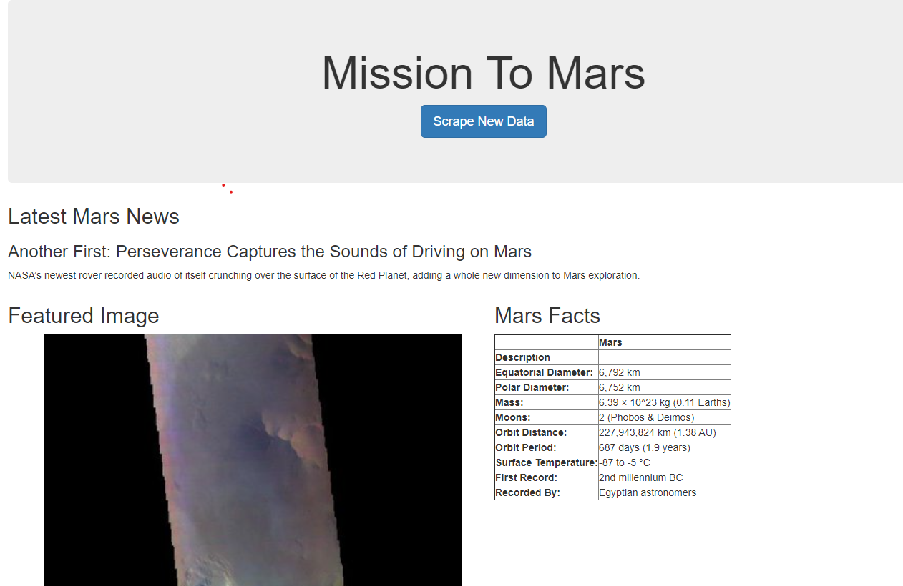
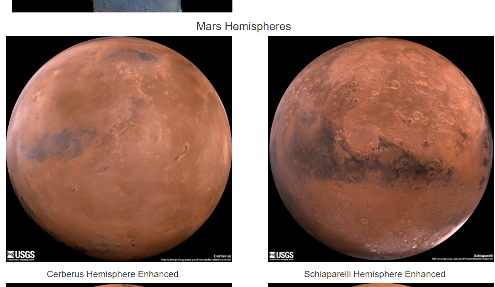
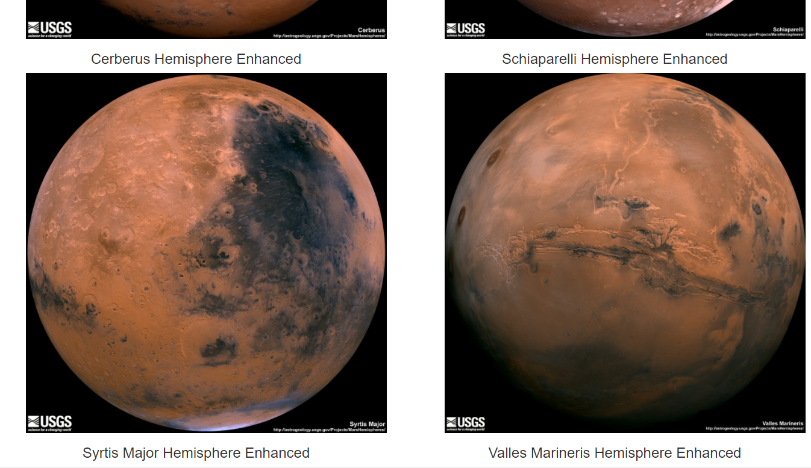

# web-scraping-challenge2

## Summary
A flask web application that scrapes various websites for data related to 
the Mission to Mars and displays the information in a single HTML page.

## Description 

I created a jupyter notebook with the scraping code and tested it there. I also created an .html file to create the website and a scrape file to make the calls.
Wrote several Scripts to scrape websites and collected the lates News Titles and Text, featured Mars Image, the latest weather and Facts about the planet, and images of each Mars' hemispheres.
Then moved that code to a .py file using visual studio.

## Tools Used

Jupyter Notebook, Python, Pandas, pymongo, flask, Visual Studio, HTML, CSS, GitBash terminal, Git Hub, beautifulsoup, splinter.

## Screen Shots

There are .png files of photos of the final web page.
New Repository because first one had problems 
